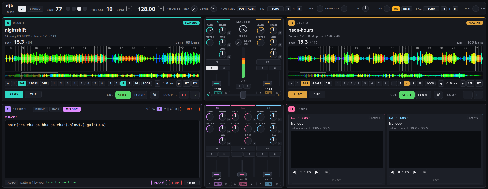
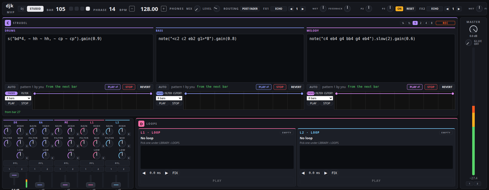
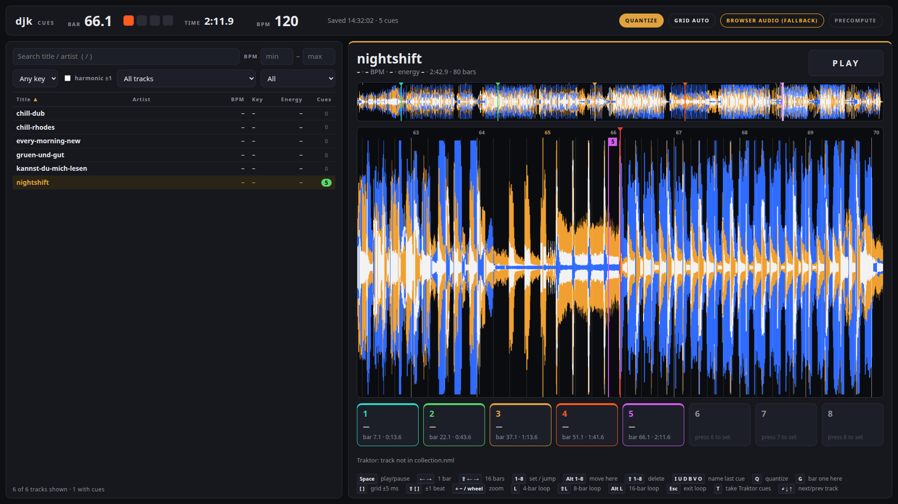

# cypher-dj

**A DJ studio that a human and an AI agent play together.** Two decks, two loop boxes, three live-coded
pattern channels and a software synthesizer, mixed by a real-time core in C++ that keeps one sample
clock. An AI agent can play along through its own set of controls; the human always has the last word.

Built in Germany by Andreas, a DJ, and Cypher, the lab's AI agent (Claude models), starting
19 September 2026.

> **Status: public beta.** It was built on one Linux machine, and Andreas plays and mixes on it there. The native parts build on
> a fresh Ubuntu 24.04 (see [INSTALL.md](INSTALL.md)), but nobody else has played a set on it yet. Code comments are in German. Issues are welcome, see [Contributing](#contributing).

## What it does

**Play**
- Two decks with a beat grid, eight hot cues, loops, beat jump and quantized jumps (1/4 beat to 4 bars)
- 3-band EQ with kill, filter, channel faders, crossfader, master and headphone cue
- Beat FX on any channel or the master: echo, flanger, phaser, filter, timed in beats
- A reverb send, and sidechain ducking of the bass and melody channels by the kick
- Two loop boxes that record, resample and play back in time
- Three [Strudel](https://strudel.cc) pattern channels (drums, bass, melody). Strudel runs as its own
  process; the core plays the resulting events at the sample
- Real instruments: Surge XT hosted in Carla, played by the patterns
- One clock: decks, loop boxes, patterns and effects are scheduled on the same sample counter in the core

**Prepare**
- A workshop that reads a track once: loudness, key, tempo map and beat grid, then renders it to the set
  tempo so it is ready to play
- A cue tool: a 3-band waveform of the whole track, hot cues set from the keyboard
- Import of grid and cues from a Traktor collection
- A library with sets that can be prepared ahead of time

**Measure before it is loud**
- A native headphone previewer, separate from the browser, which only draws
- The core measures every deck behind its closed fader: band energy, loudness, and overlap in the
  sub-bass with what is already playing
- A rule in the core: the agent may not open a deck that has not been measured first. The human may.

**Let an agent play along**
- "The hand": an [MCP](https://modelcontextprotocol.io) server with tools to load, cue, loop, set EQ and
  effects, write patterns and play instruments
- Some controls stay human-only: crossfader, master, headphone cue, bus faders and effect routing
- Any move by hand overrides the agent, and a stop control halts it
- In the conductor process, autonomy levels from 0 (listen) to 3 (transitions on its own). The
  default is 1: the agent suggests, the human decides

## More in the box

The lists above are the headline. Also in there:

- **Studio view**: the three Strudel channels side by side, each with an automation lane for fader,
  filter and cutoff over 4 to 32 bars
- **Resampling**: record the master into the loop library (1 to 32 beats, starting on the beat), cut a
  running deck loop sample-exact into a loop box, or turn a recorded loop into a Strudel sound
  (`s("rec0")`) that the drum channel can play right away
- **Sounds**: browse, load and save Surge XT patches for the bass and melody channels
- **Mixer details**: per-channel trim, a glue compressor on the master, effect routing post-fader or
  insert, a headphone cue/master blend, level meters per channel
- **Grid by hand**: nudge a track's grid, set bar one on the real downbeat, and keep it for that track
- **Cue pads** as jump cues or loop cues, quantized to the grid
- **Sets**: collect tracks for a planned set and prepare all of them in one go
- **The agent's side**: 34 tools in the MCP server. Besides playing it can listen to a deck behind its
  closed fader, read the levels of the last seconds, wait on the master clock for a number of bars, run
  automation tracks and ramps over bars, and cancel everything it started. When it has an idea while the
  human plays, it proposes; the human accepts or rejects with one key
- **Cue tool**: key and BPM filters with a harmonic-mix option (±1 on the Camelot wheel), named cues,
  4-, 8- and 16-bar loops, quantize, and taking over existing Traktor cues

## How it was built

It started on 19 September 2026 as a Strudel set in a browser, run by Cypher, played with Andreas.
The same evening there were loops cut from finished tracks, and the first correction by ear: the
loops sat 8 ms late, and only after nudging them did Andreas confirm it was better. Two days later a
single loop took four rounds: Cypher cut it, Andreas listened and said where it was off, Cypher cut
again. The circle had to get shorter: that is why the beat grid can be shifted by hand, and his
correction always wins over any measurement.

**A DJ's craft, written down.** On the evening of 22 September Andreas described how he mixes. It became
26 requirements, four more followed on 26 September. The next day 23 architecture decisions were
written against them. Some of what he said, and what came of it:

| Andreas | In the software |
|---|---|
| "the conductor must never play in anything unheard" | the agent may not open a deck the core has not measured |
| first turn the dominant element down with the EQ, usually the bass, then swap the elements | 3-band EQ with kill; planned agent moves that would open a second sub-bass channel are cancelled |
| "I had Mixed In Key. Having the keys automatically was a quantum leap" | a key analysis of its own, without Mixed In Key (76.7 % agreement, see below) |
| "keeping the pitch is a given for me" | not done yet for the decks, which run at 128 BPM. The loop boxes render a time-stretched variant when the tempo changes |

**Seeing where a track changes.** Describing how he prepares, Andreas said he mostly sets cues live,
by looking at the waveform for where the changes are: "where the vocals or breaks start. You can see
quite well where more comes in". The cue
tool shows the whole track as a 3-band waveform for exactly that. A second request followed on the
same day: "the browser should only display", so the previewer became a native audio program.

**The turn.** The plan's north star had Cypher playing one long musical journey, with Andreas stepping
in by voice. On 26 September he corrected it: "I want to play with you from the start, not alone, the
way we did with Strudel." Since then the agent interface is built for two at the same desk.

## Measured

Every number has a date. Measured on the development machine, often under load from other work,
mostly against a silent test sink. Not benchmarks.

| What | Result | Date |
|---|---|---|
| Previewer, command to first sample at the sink | median 8.3 ms over 20 plays (no real audio interface) | 2026-09-26 |
| Previewer, jumps | 8 of 8 targets sample-accurate | 2026-09-26 |
| Waveform of a whole track | 608 ms first time, 32 ms from cache (median of 10 tracks) | 2026-09-26 |
| Key detection | 76.7 % exact and 82.5 % within a neighbouring key, compared with Mixed In Key on 120 held-out tracks | 2026-09-26 |

## Known limits of the beta

- **Decks play at 128 BPM.** No keylock, no sync and no live tempo on the decks yet. Tracks are
  rendered to 128 in the workshop.
- Linux with PipeWire (JACK API) only, tested on Ubuntu 24.04. Pro-Audio device profiles cannot be
  used as outputs yet.
- The headphone path has not been measured with a real audio interface.
- The instrument round trip (core to Surge XT and back, about 11 ms) is not compensated yet.
- Human and agent are told apart by a label on localhost. That is a convention, not a security boundary.
  Do not expose the ports to a network.
- The measurement rule covers decks; the pattern channels are deliberately exempt.
- Stems, an energy fingerprint and cue suggestions are planned for the workshop, not built. An
  experimental cue-suggestion pipeline is included as a separate research tool.
- Key detection is weak on major keys (the test library is almost all minor).
- Learning from the human's judgement is planned, not built.
- Resampling into the pattern channels and the instrument channels do not follow tempo changes yet.
- Many moving parts: Rubber Band, JACK/PipeWire, ffmpeg, Node.js 22.18+, Python, and optionally
  Strudel, Carla and Surge XT. See [INSTALL.md](INSTALL.md).
- The library search expects a catalog database that is not part of this repository.
- Code comments and internal docs are in German. The interface is in English.

## Getting started

See [INSTALL.md](INSTALL.md). No music is included: bring your own tracks and samples.

## Contributing

During the beta we do not take code contributions (pull requests). Bug reports and ideas as issues
are very welcome.

## License

GNU Affero General Public License v3.0 or later, see [LICENSE](LICENSE). The core links the Rubber Band
Library (GPL) and the pattern channels load Strudel (AGPL). Third-party components:
[THIRD_PARTY.md](THIRD_PARTY.md).

Copyright (C) 2026 Infinimind Creations
