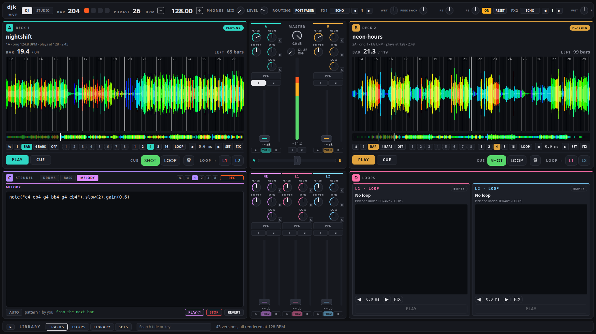
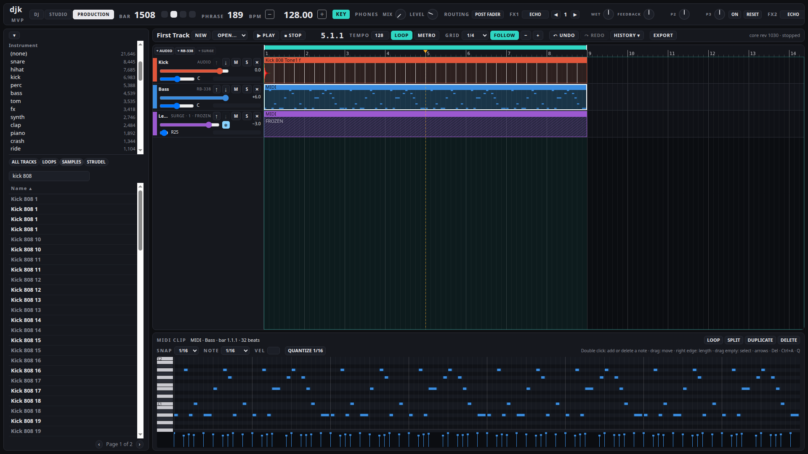
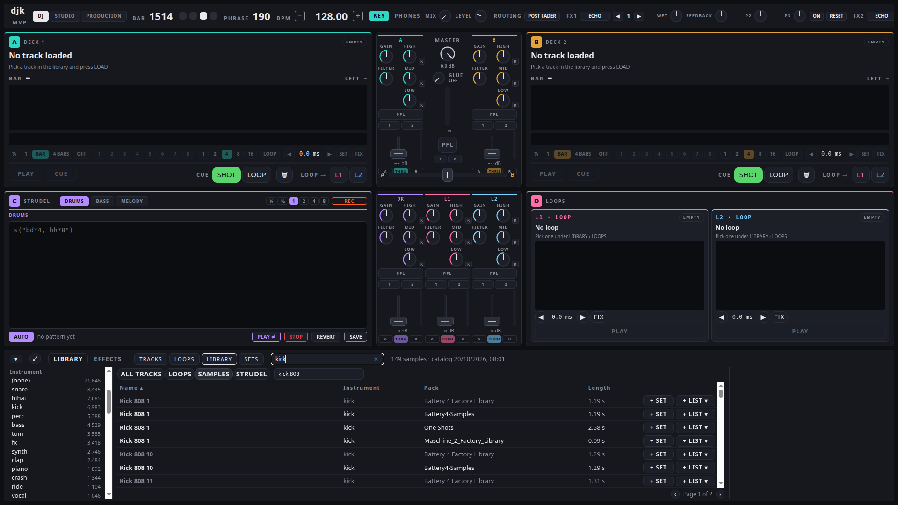
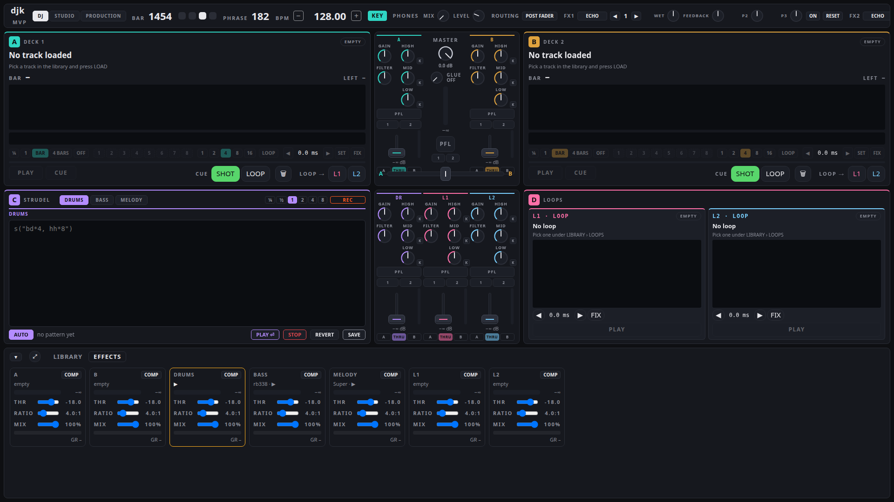
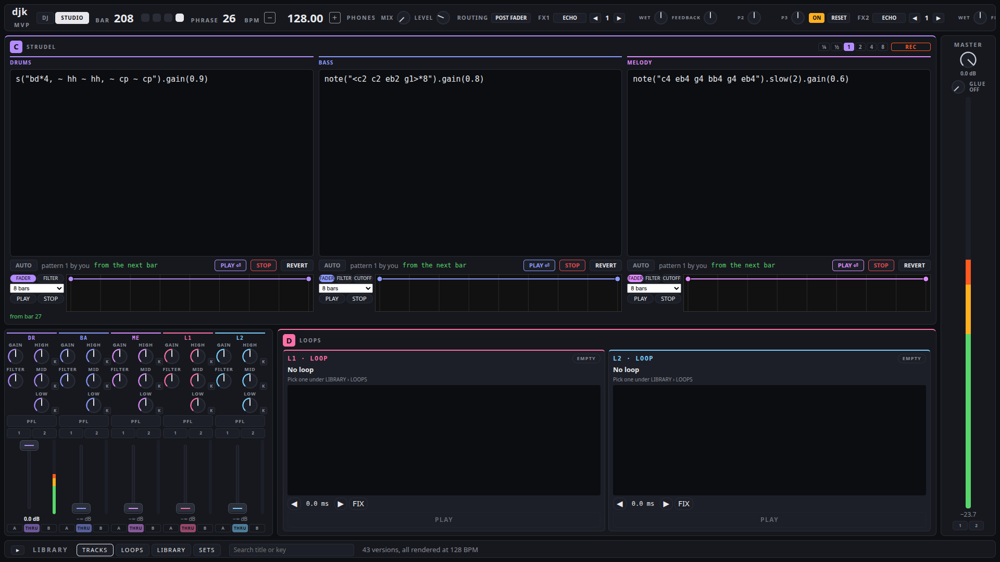
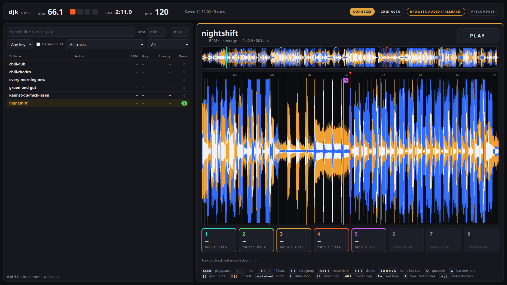

# cypher-dj

**A DJ studio that a human and an AI agent play together.** Two decks, two loop boxes, three live-coded
pattern channels and a software synthesizer, mixed by a real-time core in C++ that keeps one sample
clock. An AI agent can play along through its own set of controls; the human always has the last word.

Built in Germany by Andreas, a DJ, and Cypher, the lab's AI agent (Claude models), starting
19 September 2026.

> **Status: public beta.** It was built on one Linux machine, and Andreas plays and mixes on it there. The native parts build on
> a fresh Ubuntu 24.04 (see [INSTALL.md](INSTALL.md)), but nobody else has played a set on it yet. Code comments are in German. Issues are welcome, see [Contributing](#contributing).

## What it does

**Play**
- Two decks with a beat grid, eight hot cues, loops, beat jump and quantized jumps (1/4 beat to 4 bars)
- 3-band EQ with kill, filter, channel faders, crossfader, master and headphone cue
- Beat FX on any channel or the master, timed in beats: echo, flanger, phaser, filter, reverb, delay,
  ping pong, trans, roll, slip roll, vinyl brake and spiral
- Sound color FX on each channel's COLOR knob, as on a Pioneer mixer: filter, space, dub echo, sweep, noise
  and crush
- A compressor on every source channel (threshold, ratio, knee, attack, release, makeup, parallel mix) with
  presets and an external sidechain, for example the kick ducking the bass
- A reverb send into Cypher Hall, our own spectral reverb (see below)
- Two loop boxes that record, resample and play back in time
- Three [Strudel](https://strudel.cc) pattern channels (drums, bass, melody). Strudel runs as its own
  process; the core plays the resulting events at the sample
- Real instruments: Surge XT hosted in Carla, played by the patterns
- One clock: decks, loop boxes, patterns and effects are scheduled on the same sample counter in the core
- Live master tempo from 60 to 200 BPM, ramped over a bar: the decks and the loop boxes (key-locked,
  pitch kept), the pattern channels and recordings follow it

**Prepare**
- A workshop that reads a track once: loudness, key, tempo map and beat grid, then renders it to the set
  tempo so it is ready to play. The grid is snapped to the kick transients where they can be measured
  cleanly. On the two tracks checked against Ableton Live's warp markers (both measured against the same detected
  kick onsets), the median offset is about 1 ms. The spread from beat to beat is larger, and tracks that cannot be
  measured cleanly keep the raw grid
- A cue tool: a 3-band waveform of the whole track, hot cues set from the keyboard
- Import of grid and cues from a Traktor collection
- A library with sets that can be prepared ahead of time
- A media library browser for tracks, loops and one-shot samples: folder tree, full-text search, filters
  for key (with harmonic neighbours), BPM and energy, a waveform per item, headphone preview, and loops
  straight into a loop box
- Key and energy analysis for the whole library, with BPM filled in where it was missing

**Produce** (new in October 2026, first cut)
- A PRODUCTION view next to DJ and STUDIO: arrangement with a timeline, library browser, detail area for the selected
  clip, transport bar
- Audio tracks: drag a sample from the library onto a track; clips snap to the grid and can be moved, trimmed, split,
  duplicated, faded and looped inside their length
- Instrument tracks with the built-in RB-338 or with Surge XT (one hosted slot in this cut); notes are drawn in a
  piano roll with velocity and 1/16 quantize
- Tempo, loop range and metronome; per track volume, pan, mute, solo and a meter
- Projects are folders with a JSON file; every change is one undo step, and the undo history survives a restart
- Variants: tracks can share a group (say bass A, B, C); one click in the transport bar makes one of them audible
  and mutes the others, as a single undo step
- Per-track loudness: an offline render measures integrated LUFS, LRA and true peak of every track as it sits in the
  mix (mute and solo count as in the mix); the tracks add up to the export within 0.1 LU
- Stop Cypher hands the arrangement over instead of stopping it: what plays keeps playing, Cypher stops acting, and a
  start of Cypher's that is still waiting for its bar is dropped
- WAV export as an offline render by the same core that plays live. Hosted instrument tracks are frozen first, so the
  file matches what was heard (see [Measured](#measured))
- The agent builds and edits the same projects through its own tools (create tracks, write clips and notes, mix,
  start the transport, export)

**Measure before it is loud**
- A native headphone previewer, separate from the browser, which only draws
- The core measures every deck behind its closed fader: band energy, loudness, and overlap in the
  sub-bass with what is already playing
- A rule in the core: the agent may not open a deck that has not been measured first. The human may.

**Let an agent play along**
- "The hand": an [MCP](https://modelcontextprotocol.io) server with tools to load, cue, loop, set EQ and
  effects, write patterns and play instruments
- Some controls stay human-only: crossfader, master, headphone cue, bus faders and effect routing
- Any move by hand overrides the agent, and a stop control halts it
- In the conductor process, autonomy levels from 0 (listen) to 3 (transitions on its own). The
  default is 1: the agent suggests, the human decides
- A skill for Claude Code in [`skills/djk-live/`](skills/djk-live/SKILL.md) that teaches an agent how to play
  *with* a human: think about what a move does before making it, crossfade instead of swapping, one change
  every 8 bars and announce it first. Copy the folder into the skills folder of Claude Code (`.claude/skills` in your home directory) to use it

## Own instruments and effects

Written in Rust, each as a DSP library plus a VST3 plugin (built with nih-plug), measured against
references before they went in:

- **Cypher EQ**: a parametric 8-band EQ (a filter bank of state-variable filters, 2x oversampled) whose
  curves follow the analog target curve up to 20 kHz within 0.27 dB, where a plain bilinear design is
  off by several dB near the top
- **Cypher Hall**: a spectral reverb (energy decay per frequency bin, early reflections, frequency-wise
  ducking, freeze). It is the reverb on the send and the REVERB beat FX
- **Cypher Komp**: a feed-forward compressor after Giannoulis, Massberg and Reiss (2012) with soft knee,
  parallel mix, external sidechain and a high-pass in the detector; six presets
- **Cypher Saett**: a tanh saturator with first-order antiderivative antialiasing (Bilbao et al. 2017)
  at 2x oversampling; on a hard-driven sawtooth the aliasing stays below -60 dB, against -50 dB without
  oversampling. Available as a plugin, not yet in the core
- **RB-338**: a 303-style bass voice with cutoff, resonance, envelope, decay, accent and slide, playable
  from the bass pattern channel instead of Surge XT

## More in the box

The lists above are the headline. Also in there:

- **Studio view**: the three Strudel channels side by side, each with an automation lane for fader,
  filter and cutoff over 4 to 32 bars
- **Effects section**: one strip per channel showing what plays and how much the compressor pulls, an
  expanded view with every control, and automation per loop for compressor, filter, hall send and EQ
- **Resampling**: record the master into the loop library (1 to 32 beats, starting on the beat), cut a
  running deck loop sample-exact into a loop box, or turn a recorded loop into a Strudel sound
  (`s("rec0")`) that the drum channel can play right away
- **Sounds**: browse, load and save Surge XT patches for the bass and melody channels
- **Mixer details**: per-channel trim, a glue compressor on the master, effect routing post-fader or
  insert, a headphone cue/master blend, level meters per channel
- **Grid by hand**: nudge a track's grid, set bar one on the real downbeat, and keep it for that track
- **Cue pads** as jump cues or loop cues, quantized to the grid
- **Sets**: collect tracks for a planned set and prepare all of them in one go
- **The agent's side**: 34 tools in the MCP server. Besides playing it can listen to a deck behind its
  closed fader, read the levels of the last seconds, wait on the master clock for a number of bars, run
  automation tracks and ramps over bars, and cancel everything it started. When it has an idea while the
  human plays, it proposes; the human accepts or rejects with one key
- **Cue tool**: key and BPM filters with a harmonic-mix option (±1 on the Camelot wheel), named cues,
  4-, 8- and 16-bar loops, quantize, and taking over existing Traktor cues

## How it was built

It started on 19 September 2026 as a Strudel set in a browser, run by Cypher, played with Andreas.
The same evening there were loops cut from finished tracks, and the first correction by ear: the
loops sat 8 ms late, and only after nudging them did Andreas confirm it was better. Two days later a
single loop took four rounds: Cypher cut it, Andreas listened and said where it was off, Cypher cut
again. The circle had to get shorter: that is why the beat grid can be shifted by hand, and his
correction always wins over any measurement.

**A DJ's craft, written down.** On the evening of 22 September Andreas described how he mixes. It became
26 requirements, four more followed on 26 September. The next day 23 architecture decisions were
written against them. Some of what he said, and what came of it:

| Andreas | In the software |
|---|---|
| "the conductor must never play in anything unheard" | the agent may not open a deck the core has not measured |
| first turn the dominant element down with the EQ, usually the bass, then swap the elements | 3-band EQ with kill; planned agent moves that would open a second sub-bass channel are cancelled |
| "I had Mixed In Key. Having the keys automatically was a quantum leap" | a key analysis of its own, without Mixed In Key (76.7 % agreement, see below) |
| "keeping the pitch is a given for me" | every track is time-stretched once to the set tempo with Rubber Band, pitch kept, so a 124.8 BPM track plays at 128 in its own key. The loop boxes do the same when the master tempo changes |

**Seeing where a track changes.** Describing how he prepares, Andreas said he mostly sets cues live,
by looking at the waveform for where the changes are: "where the vocals or breaks start. You can see
quite well where more comes in". The cue
tool shows the whole track as a 3-band waveform for exactly that. A second request followed on the
same day: "the browser should only display", so the previewer became a native audio program.

**The turn.** The plan's north star had Cypher playing one long musical journey, with Andreas stepping
in by voice. On 26 September he corrected it: "I want to play with you from the start, not alone, the
way we did with Strudel." Since then the agent interface is built for two at the same desk.

## Measured

Every number has a date. Measured on the development machine, often under load from other work,
mostly against a silent test sink. Not benchmarks.

| What | Result | Date |
|---|---|---|
| Previewer, command to first sample at the sink | median 8.3 ms over 20 plays (no real audio interface) | 2026-09-26 |
| Previewer, jumps | 8 of 8 targets sample-accurate | 2026-09-26 |
| Waveform of a whole track | 608 ms first time, 32 ms from cache (median of 10 tracks) | 2026-09-26 |
| Key detection | 76.7 % exact and 82.5 % within a neighbouring key, compared with Mixed In Key on 120 held-out tracks | 2026-09-26 |
| Production export against live playback (3 tracks: audio loop, RB-338, frozen Surge XT, 32 beats) | residual peak -200 dBFS, i.e. sample-identical; shifting one track by a single sample turns the test red | 2026-10-17 |
| Audio callback p99.9 with an arrangement playing, quantum 256 | 642 to 789 µs over three runs; 755 to 904 µs with exports rendering in parallel | 2026-10-17 |

## Known limits of the beta

- **Decks keep their pitch at any master tempo, in real time, including during a tempo ramp.** After each
  deck event (start, jump, hotcue) a bridge of about 0.1 s plays in varispeed until the stretcher takes over.
  A deck started by hand does not start while a tempo change is pending or ramping: from the moment the tempo
  changes until the end of its one-bar ramp, which begins on the next downbeat.
- Linux with PipeWire (JACK API) only, tested on Ubuntu 24.04. Pro-Audio device profiles cannot be
  used as outputs yet.
- The headphone path has been checked for signal and level on one USB DAC; its latency and unplugging and
  replugging a device have not been measured.
- Bar-one (downbeat) detection is unreliable; set bar one by hand where it is wrong.
- The instrument round trip (core to Surge XT and back, about 11 ms) is compensated by sending notes early;
  the value was measured against the real instrument at one audio buffer size (256 frames); the offset scales
  with the buffer size and has been checked in software at 128 and 512.
- Human and agent are told apart by a label on localhost. That is a convention, not a security boundary.
  Do not expose the ports to a network.
- The measurement rule covers decks; the pattern channels are deliberately exempt.
- Stems, an energy fingerprint and cue suggestions are planned for the workshop, not built. An
  experimental cue-suggestion pipeline is included as a separate research tool.
- Key detection is weak on major keys (the test library is almost all minor).
- Learning from the human's judgement is planned, not built.
- Production is a first cut: at most 8 tracks, one hosted instrument slot, no recording, automation, sends or plugin
  inserts yet. Export is refused while the transport is running. The live track meters show sample peaks; loudness is
  measured offline (per track or in the export).
- Sounds saved from a loop into the pattern channels play at their recorded speed, and parameter rides on the
  hosted instrument keep their duration in seconds; neither follows tempo changes yet.
- Many moving parts: Rubber Band, JACK/PipeWire, ffmpeg, Node.js 22.18+, Python, and optionally
  Strudel, Carla and Surge XT. See [INSTALL.md](INSTALL.md).
- The library search expects a catalog database that is not part of this repository.
- Code comments and internal docs are in German. The interface is in English.

## Getting started

See [INSTALL.md](INSTALL.md). No music is included: bring your own tracks and samples.

## Contributing

During the beta we do not take code contributions (pull requests). Bug reports and ideas as issues
are very welcome.

## License

GNU Affero General Public License v3.0 or later, see [LICENSE](LICENSE). The core links the Rubber Band
Library (GPL) and the pattern channels load Strudel (AGPL). Third-party components:
[THIRD_PARTY.md](THIRD_PARTY.md).

Copyright (C) 2026 Infinimind Creations
